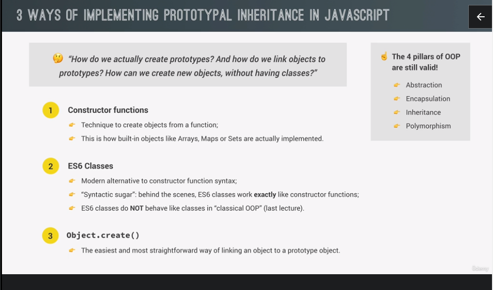

The OOPS in JS is different that OOPS in other languages, it has prototypes rather than classes and objects scenario.



## Lets see a little theory about prototypal inheritance.


In the picture,as we can see since jonas object doesn't have the calcAge(), js checks up in the prototypal chain, that is the Person.prototype which is actually the prototype of jonas object, it is also defined in jonas.\_\_proto\_\_ property.

But the chain does not end at Person, lets go further.Since Person.prototype is also an object, therefore it must also have a prototype which is drum rolllllllllllllllll **Object.prototype**, it is not the prototype of Person() but of Person.prototype(which is an object.)

```js
"use strict";

const Person = function (p_name) {
  this.p_name = p_name;
};

const harshit = new Person("harshit");
console.log(harshit.__proto__);
console.log(harshit.__proto__ === Person.prototype);

console.log(Person.prototype.__proto__ === Object.prototype); //* this is true indicating Object.prototype is the prototype of Person.prototype(which is an object so it must have a prototype.), it is not the prototype of Person() but of Person.prototype.
```


Inheritance using ctr functions


**this one is imp**


<h1>its basically every ctr function has its corresponding prototypical object.!!!!!!!!!, which either inherits or gets inherited.</h1>

Inheritance among Object.create()


