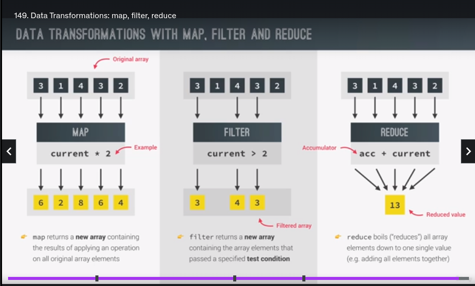

- Map is used as the name suggests to mpa, the values, it is very similar to a forEach loop, but with the difference being that **it creates a new array and the original array is not changed(but forEach mutates the original array)**.
- Filter, filters out the values and again **returns a new array**.
