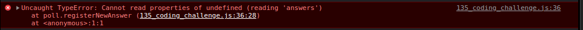

```javascript
const poll = {
  question: "What is your favourite programming language?",
  options: ["0: JavaScript", "1: Python", "2: Rust", "#: C++"],
  answers: new Array(4).fill(0),
  registerNewAnswer() {
    let choice = Number(
      prompt(`What is your favourite programming language?
    0: JavaScript
    1: Python
    2: Rust
    3: C++`)
    );
    if (!isNaN(choice)) this.answers[choice % 4]++;
    this.displayResults();
  },
  displayResults(type = "array") {
    type === "array"
      ? console.log(this.answers)
      : console.log(`Poll results are ${this.answers.join(",")}`);
  },
};
```

In the above code snippet, if the object methods are called as poll.registerNewAnswer() or poll.displayResults(), only then the **_"this"_** will point to the **_poll object_**.

If they are passed as event handlers like,

```javascript
document.addEventListner("click", poll.registerNewAnswer);
```

Here, it is just passed as a normal fucntion(a value), therefore **"this"** no longer points to **poll object** but to the **html element** because that is its value in this scenario, because thats how it is supposed to work.

Similarly,

```javascript
const func = poll.registerNewAnser;
func();
```

When you **call func()**, even now, **this** doesnt point to the **poll object**, because again it is copied as a normal function(a value) in func, and we know for normal functions **this** is set to **undefined** in **strict mode**, so you get the following error.

</img>

In order to make all of this work, we use **call** or the **bind** functions to change their **"this"** explicitly.

```javascript
func.call(poll);

//or

func1 = func.bind(poll);
//this returns a function whose "this" is binded with poll object.
func1();

//or
document.addEventListener("click", poll.registerNewAnswer.bind(poll));
```

Above code says, call the func on the poll object , so **this** is explicitly set to **poll**.
